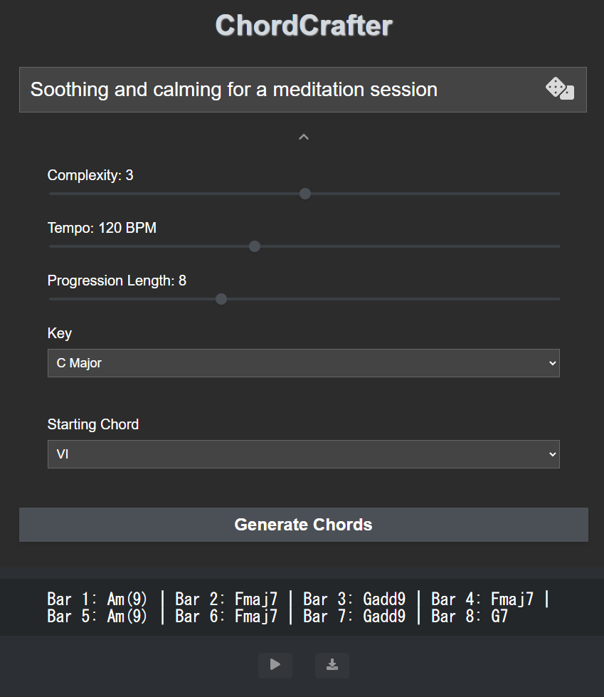

# ChordGPT

ChordGPT is a web application for music creators and performers that generates chord progressions based on user-defined parameters and prompts. It utilizes OpenAI's ChatGPT API to create musically interesting and harmonically rich chord progressions suitable for various complexity levels, keys, tempos, and lengths.



## Installation and Usage

To set up and run ChordGPT locally, follow these steps:

1. Clone the repository:

```
git clone https://github.com/oguchi22/ChordGPT
```

2. Change to the project directory:

```
cd chordgpt
```

3. Install the required dependencies:

```
yarn install
```

4. Set up your `.env` file

- Copy `.env.example` into `.env` and add your OpenAI API key and model name
- Your `.env` file should look like this:

```
REACT_APP_OPENAI_API_KEY=your_api_key_here
REACT_APP_OPENAI_API_MODEL=gpt-3.5-turbo
```

5. Start the development server:

```
yarn start
```

Open your web browser and navigate to http://localhost:3000 to use the application.

## Features

- Generate chord progressions based on complexity level, key, tempo, and length
- Play and download generated chord progressions as MIDI files

## Demo

A live demo of ChordGPT is available for demonstration purposes. You can try out the application and see it in action by visiting the following link:

[ChordGPT Demo](https://oguchi22.github.io/ChordGPT/)
